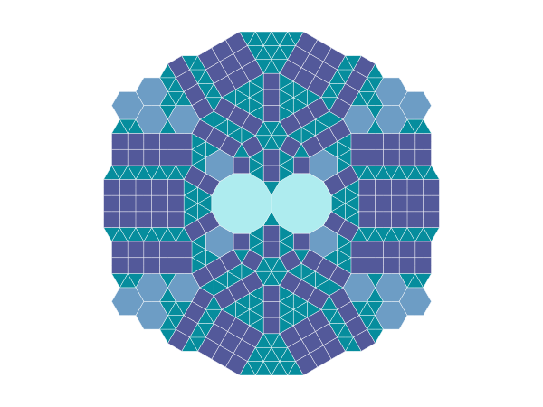
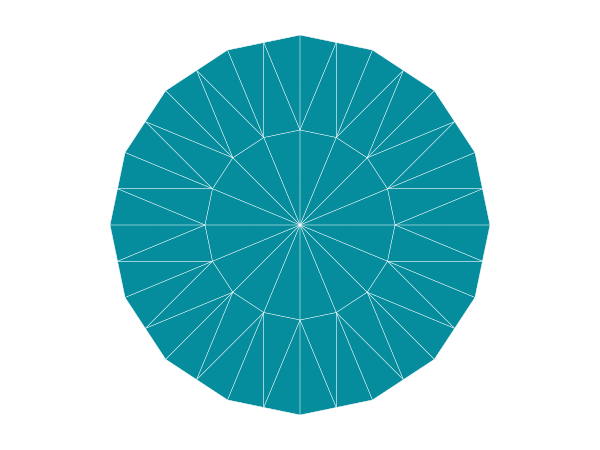

# Turtle Tiling Project

This project features Samy's tiling, which has all vertex types except for the 4-8-8, which would extend to infinity if included.

Below, there is also a beautiful flower tiling, with congruent triangles arranged symmetrically around a point.

Feel free to use the library to create your own tiling or to modify the existing ones.

The tiling is generated by moving around a point and adding the tiles around it. The tiling is then saved as an SVG file. Take a look at the [examples](examples) folder to see how it's done.
