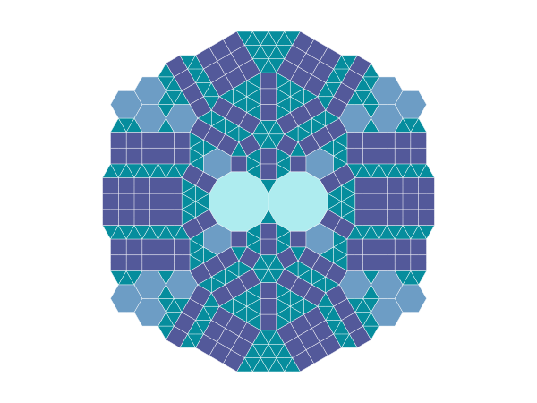

This project features Samy's tiling, which has all vertex types except for the 4-8-8, which would extend to the infinity if included.

Feel free to use the library to create your own tiling, or to modify the existing one. The library is written in Julia, and the tiling is generated using the Cairo library.

The tiling is generated by moving around a point and adding the tiles around it. The tiling is then saved as an SVG file. Take a look at the  to see how it's done.